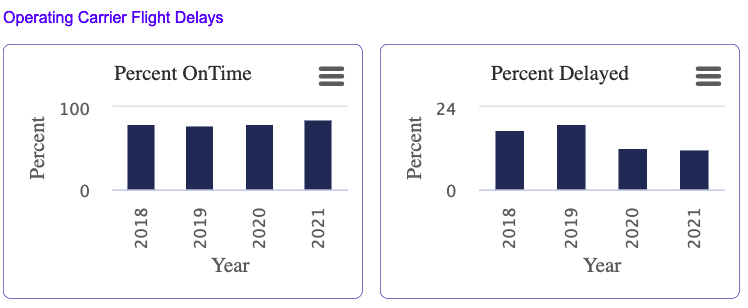
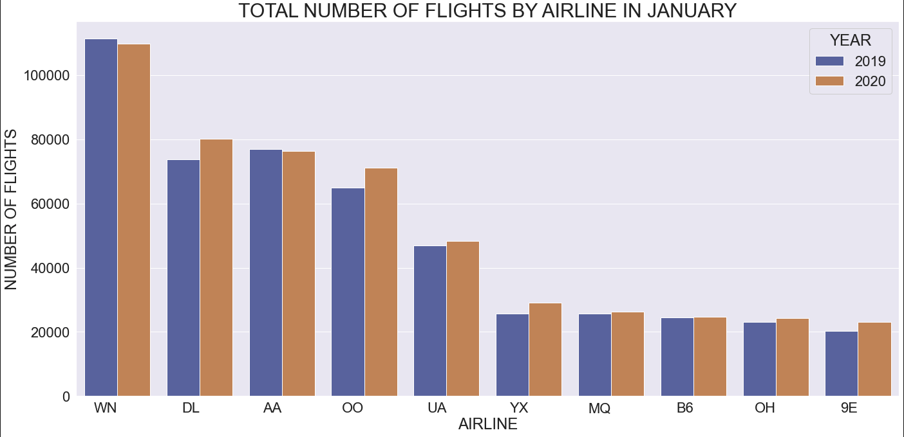
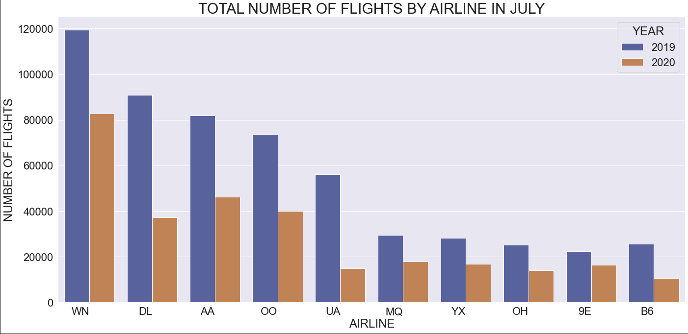
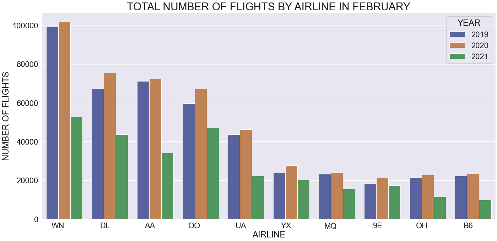
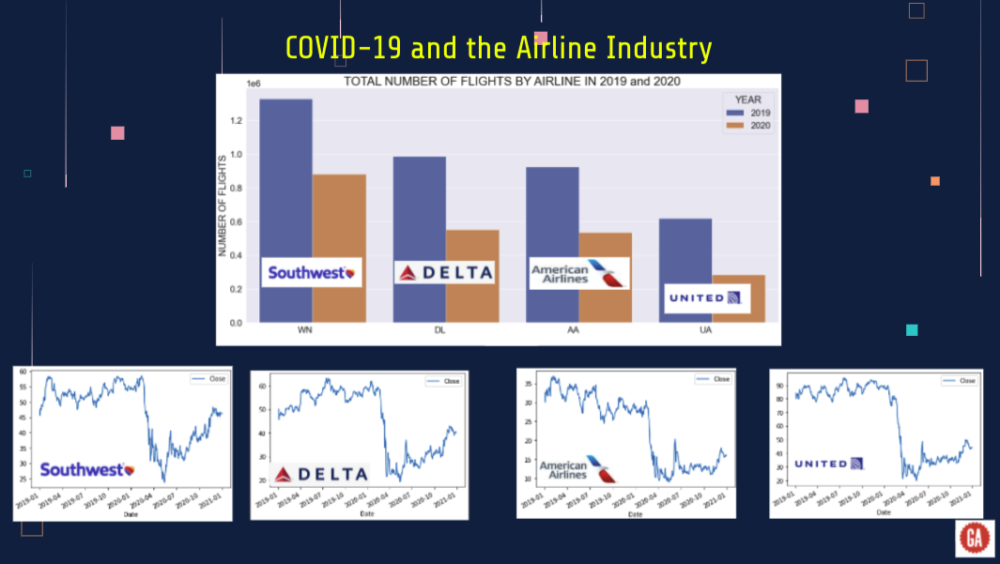
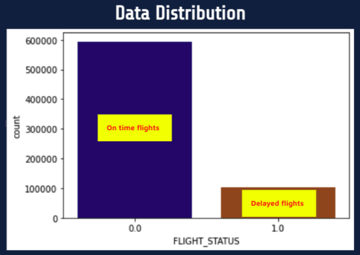

# <b>PREDICTING ARRIVAL DELAYS FOR MAJOR US AIRLINES</b>

# INTRODUCTION AND PROBLEM STATEMENT

The Capstone project is the cornerstone project that is the essence of the Data Science Immersive program at General Assembly. The aviation industry is of great importance for a globally connected economy. Customer satisfaction with airlines and airport performance is considerably influenced by how much flights are delayed.
I am very passionate about the airline industry decided to do my project with a dataset that is composed of domestic flights within the United States with data from January of 2019 to December of 2020. I wanted to make sure the dataset covered the pre-Covid 19 period as well as the year 2020. I will use the aggregate data for the years 2019 and 2020 to make some comparison on how the COVID-19 has impacted the airline industry and use the data from 2019 to run my machine learning algorithms to predict flight delays at arrivals. I have chosen the 20 busiest airports within the united states as well as four main airlines namely American, Delta, United and Southwest airlines.

According to data from the United States Bureau of Transportation Statistics (BTS), almost 20% of flights within the U.S were delayed at arrival in 2019, which resulted in a severe economic impact equivalent to circa 41 billion US$ (A delayed flight is a flight that is delayed 15 minutes or more).

Figure 1. Percentage of flight delays

# DATA COLLECTION AND EXPLORATION

### Overview of the data set

My dataset has been taken from the United States government agency website that provides the air traffic delay statistics in the U.S.
The U.S. Department of Transportation's (DOT) Bureau of Transportation Statistics performance of domestic flights operated by large air carriers. BTS compiles daily data for the benefit of the customers or for data practitioner like myself. The dataset is comprised of 2019, 2020 and the first 2 months of 2021 reporting on time performance.

I have included the following column headers: Year, Quarter, Month, DayofMonth, DayofWeek, flight date, Reporting_Airline, DOT_ID_Reporting_Airline, IATA_CODE_Reporting_Airline, Tail_Number, OriginAirportID, OriginAirportSeqID, OriginCityMarketID, Origin, OriginCityName, OriginState, OriginStateName, OriginWac, DestAirportID, DestAirportSeqID, DestCityMarketID, Dest, DestCityName, DestState, DestWac, CRSDepTime, DepTime, DepDelay, DepDelayMinutes, DepDel15,DepTimeBlk,CRSArrTime, ArrTime, ArrDelay, ArrDelayMinutes, ArrDel15, Cancelled, Flights and Distance.

### Data Exploration

Data cleaning is the critical initial step in evaluating the dataset for final analysis. With the enormous amount of data available, databases are prone to have noisy, missing and inconsistent data. 
From all flights in the dataset, less than 0.005 percent were cancelled thus the vast majority of flight were not. I decided not to use the canceled flights column for my analysis.
Also, I did not take into account the folllowing delays for my analysis: Carrier Delay, Weather delay, security dealy and late aircraft delay because 88.97 percent of the data was missing in those categories.
The BTS website does not allow dowloading the dataset all at once. I had to do it on a monthly basis for the years 2019 and 2020. After the data was downloaded as CSV files onto my computer, I did some cleaning and create 2 separates dataframes for 2019 and 2020 and also a combined dataframe for 2019-2020 (6,112,240 rows × 24 columns).
Below are some data vizualization I did on Seaborn and Matplotlib

Let's take a look at the Pre-COVID-19 and during COVID-19 flights

Figure 2. Total number of flights in january of 2019 and 2020 (Pre-Covid19) for the top 10 U.S airlines

The above slide shows the total number of flights per airline in January of 2019 and 2020. As you can see 2020 was starting off as a great year for the airline industry. 
According to Wikipedia the first cases in North America were reported in the United States on the 23 January 2020.

Figure 3. Total number of flights in July of 2019 and 2020 (During Covid19) for the top 10 U.S airlines

Figure 4. Total number of flights in February of 2019, 2020 and 2021 (During Covid19) for the top 10 U.S airlines

The travel industry has picked up since last summer however according to fortune.com Demand will reach 43 percent of 2019 levels during 2021—a more optimistic outlook than issued in February, but less bullish than in December, when vaccines were first being rolled out.
The figure below show that the month of May 2020 was the lowest point

Figure 5. Stock prices and total number of flights for the top 4 major U.S airlines in 2019 and 2020

## MODELING

Now that my data has been cleaned and preprocessed, it's time to start with the modeling phase which again as I sais earlier will focus on the year 2019 (pre-Covid19). We have a bianry classification problem here where a "0" will corresponfd to a flight being on time and a "1" means that the flight is delayed.

I have tested the following machines learning algorithms appropraite for classification problems.

1. Logistic Regression
2. Decision Trees
3. AdaBoost
4. Random Forest
5. K-Nearest Neighbors
6. Neutal Networks

As per machinelearningmastery.com , imbalanced classification involves developing predictive models on classification datasets that have a severe class imbalance wich is the case with my dataset.

The challenge of working with imbalanced datasets is that most machine learning techniques will ignore, and in turn have poor performance on, the minority class, although typically it is performance on the minority class that is most important.

One approach to addressing imbalanced datasets is to oversample the minority class which I did. The simplest approach involves duplicating examples in the minority class, although these examples don’t add any new information to the model. Instead, new examples can be synthesized from the existing examples. This is a type of data augmentation for the minority class and is referred to as the Synthetic Minority Oversampling Technique, or SMOTE for short.
I created 2 sets of machine learning models, one for the imbalanced dataset and another one for the "Oversampled" balanced dataset.

Fig 6. On time and delayed flights data distribution for the year 2019

## MACHINE LEARNING

# CONCLUSIONS AND FUTURE WORK

# BIBLIOGRAPHY
