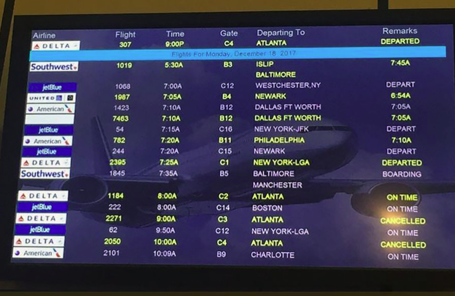

# <b>PREDICTING ARRIVAL DELAYS FOR MAJOR US AIRLINES</b>

# Introduction
According to data from the United States Bureau of Transportation Statistics (BTS), almost 20% of flights within the U.S were delayed at arrival in 2019, which resulted in a severe economic impact equivalent to circa 41 billion US$ (A delayed flight is a flight that is delayed 15 minutes or more).

